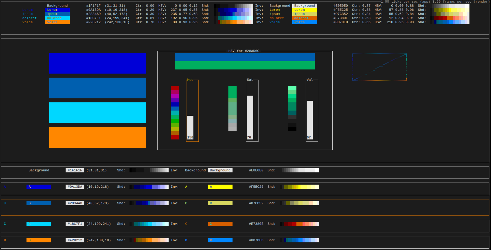

# termcolors-tui

1. Displays colors in the terminal.

2. For quick preview when developing TUIs.

3. Based on a five color scheme.

4. Colors can be selected for changing or viewing the shades. (default: `Tab`).

5. Colors can be changed via a prompt that takes RGB or hex values. (default: `q`).

6. All changes are undo- and redo'able.

7. Hotkeys are fully configurable via a config file.

8. `Clone` and `cargo run`

## Future plans

1. Saving of color palettes in a file   [ ]
2. Selection of colors via shades       [✓]
3. Palette generation                   [ ]
4. HSV sliders                          [✓*]
5. Paste from clipboard w/o mouse       [ ]
6. Default palette in config            [ ]

## Screenshot

## Info

Made with [ratatui](https://github.com/ratatui-org/ratatui)

and the [async-template](https://github.com/ratatui-org/ratatui-async-template)

